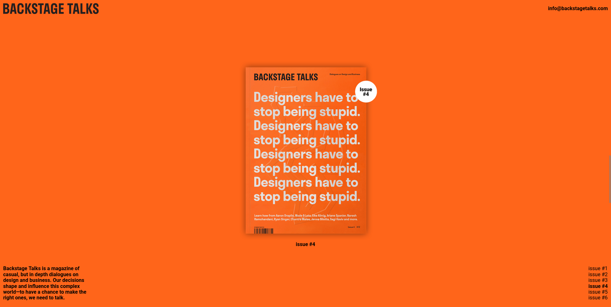
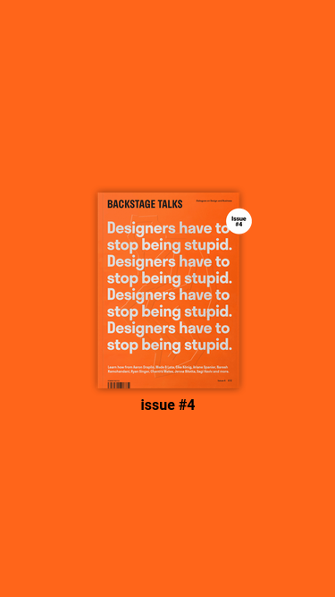

# Frontend Practice Challenge - [backstage Talks

## Description

This repository contains my solution to the [backstage Talks](https://www.frontendpractice.com/projects/backstage-talks) from the Frontend Practice website. The challenge involved building a landing page called "Backstage Talks."

## Technologies Used

- HTML
- CSS
- JavaScript (if applicable)

## Screenshots

### Desktop View

### Mobile View

## What I Learned

In this challenge, I learned and applied various frontend development concepts and techniques, including:

- using scroll-snap-type to add snapping to the scroll
- us smooth-scroll to add a transition to scrolling
- creating elements dynamically for better scalability

## Getting Started

If you'd like to view the project locally, you can follow these steps:

1. Clone the repository: `git clone https://github.com/mohamedyasser27/backstage-talks.git`
2. Open the index.html file in your preferred web browser.
3. start the live server

If you'd like to view the Final Result you can visit this 
